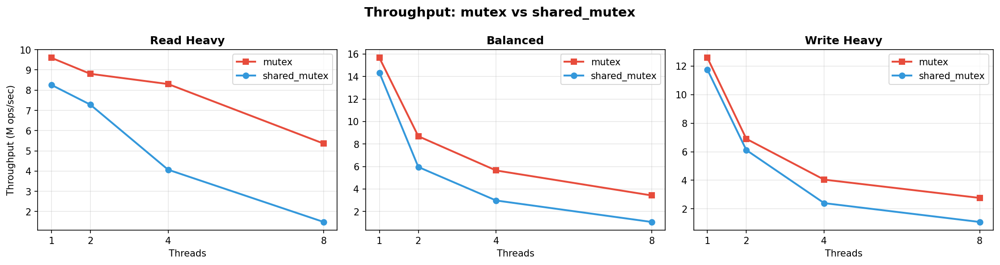
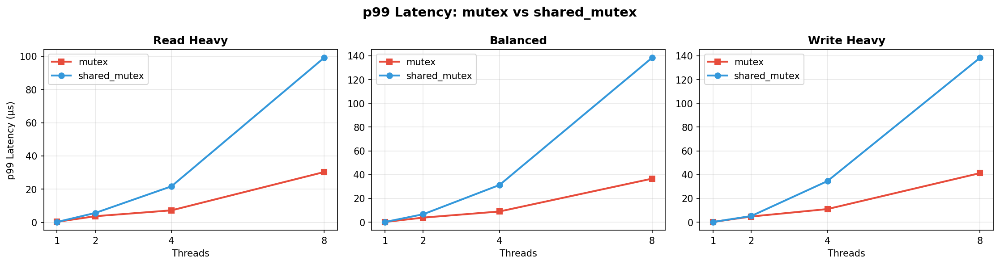
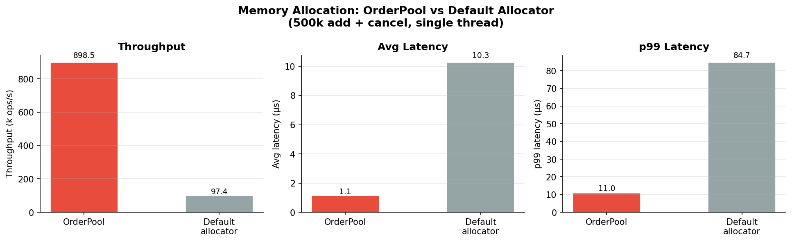
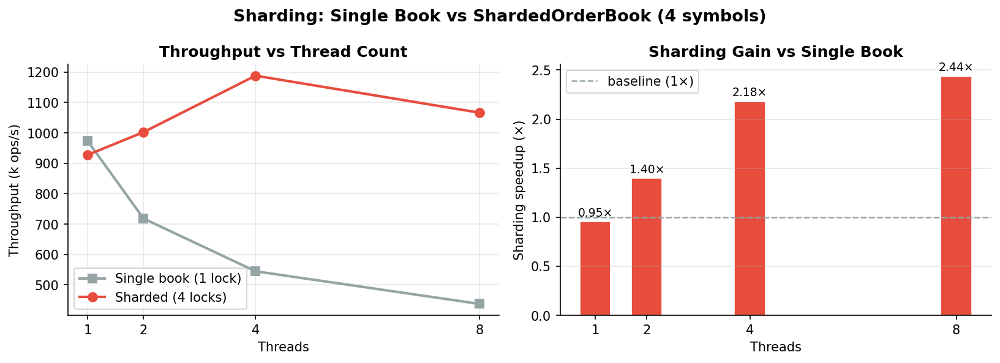

# Concurrent Order Book

A C++17 limit order book built to answer a question I kept second-guessing: does
`std::shared_mutex` actually buy anything in a read-heavy matching engine, or is it
overhead dressed up as optimization?

The short answer turned out to be uncomfortable. Then the follow-up question —
*why* — led to a deeper investigation into memory allocation and lock contention
that became v2.

Two branches tell the story:

- **`main`** — v1: the original lock-policy experiment
- **`v2-upgrade`** — v2: a full matching engine with memory pool and per-symbol sharding

---

## TL;DR

- Built a C++17 matching engine to benchmark `std::mutex` vs `std::shared_mutex` under real contention
- Discovered `shared_mutex` was **3.6× slower** due to atomic reader-count overhead dominating short critical sections
- Developed v2 with a custom memory pool and per-symbol sharding — achieving **8.9× throughput improvement** and **2.4× gain at 8 threads**

---

## v1: The Hypothesis That Didn't Hold

The setup was straightforward: the same order book logic compiled against two lock
policies — `std::mutex` (exclusive) and `std::shared_mutex` (readers shared, writers
exclusive) — then benchmarked across three workloads and four thread counts.

I expected `shared_mutex` to pull ahead on read-heavy workloads. With 8 threads and
95% reads, you'd theoretically have 7+ threads reading concurrently. That should be
a landslide.

It wasn't.





*The p99 spike at 4–8 threads marks where lock overhead starts dominating actual work.
shared_mutex's fairness machinery amplifies this far more than mutex.*

### Key numbers (8 threads)

| Workload | mutex throughput | shared_mutex throughput | mutex p99 | shared_mutex p99 |
|----------|-----------------|------------------------|-----------|------------------|
| read_heavy (95/5) | 5.4M ops/sec | 1.5M ops/sec | 30 μs | 99 μs |
| balanced | 3.4M ops/sec | 1.1M ops/sec | 37 μs | 138 μs |
| write_heavy | 2.8M ops/sec | 1.1M ops/sec | 41 μs | 138 μs |

`shared_mutex` was 3.6× slower on throughput and 3.3× worse on p99. Every
configuration. Every workload.

### What's actually happening

`best_bid_price()` does one thing: dereference `bids_.rbegin()`. That's 10–20 ns
of real work. `std::shared_mutex` needs two atomic operations just to enter and exit
a shared lock — an atomic increment of the reader count on entry, a decrement on
release — plus memory barriers. When the lock overhead is the same order of
magnitude as the protected work, reader concurrency stops being an advantage.

There's also the reader-count contention that catches people off guard. Readers
"don't block each other" in the sense that they can all hold the lock at once, but
they're still all hammering the same atomic counter variable. At 8 threads in a tight
loop, that cache line bounces between cores constantly.

`std::mutex` on macOS uses `os_unfair_lock` — a single CAS, explicitly unfair (no
turn-taking), zero reader-count machinery. When the critical section is short, that
simplicity wins.

This is platform-specific. Linux's `pthread_rwlock` might tell a different story,
especially on NUMA systems where data locality and coherency costs are more
pronounced. The real lesson is that locking intuition built on theory doesn't
survive contact with actual hardware — you have to measure.

---

## v2: Chasing the Real Bottlenecks

After confirming the locking results, the more interesting question was: if the lock
itself isn't the primary bottleneck, what is?

Profiling pointed at two things: **heap allocation** on every order insertion, and
**global lock contention** across unrelated symbols. v2 addresses both.

### Architecture

```
ShardedOrderBook<LockPolicy>
└── books_  : unordered_map<symbol_id, OrderBook>  // per-symbol, independent locks

OrderBook<LockPolicy>
├── pool_   : OrderPool                             // pre-allocated contiguous slots
├── bids_   : map<price, list<Order*>>              // pointers into pool
├── asks_   : map<price, list<Order*>>              // pointers into pool
└── orders_ : unordered_map<id, Order*>             // O(1) cancel lookup

OrderPool
├── slots_    : Slot[]     // contiguous array, sizeof(Order) per slot
└── free_list_: size_t[]   // O(1) stack of available indices
```

The v1 architecture for comparison:

```
OrderBook<LockPolicy>
├── bids_   : map<price, list<Order>>   // owns Order objects directly
└── orders_ : unordered_map<id, Order*>
```

### Custom Memory Pool (OrderPool)

Every `list::push_back` in v1 called `operator new` internally. Over millions of
orders, this scatters Order objects across heap memory — terrible for data locality
and cache performance. It also means the OS allocator gets hit on every single order
arrival, with all the global lock and free-list overhead that entails.

The fix is a pre-allocated slab: a contiguous array of `sizeof(Order)` slots managed
by an O(1) free-list. Allocation is a single array index pop; deallocation pushes the
index back. No OS call, no fragmentation, and Orders land in adjacent memory where
prefetchers can actually help.

**Benchmark: 500k add + cancel operations, single thread**



| Allocator | Throughput | Avg latency | p99 latency |
|---|---|---|---|
| OrderPool | 863k ops/s | 1,158 ns | 11,416 ns |
| `std::list<Order>` default | 97k ops/s | 10,275 ns | 86,167 ns |
| **Speedup** | **8.9×** | **8.9×** | **7.5×** |

The gain is almost entirely from eliminating allocator calls. The cache locality
improvement on top of that is harder to isolate but shows up in the p99 numbers.

### Per-Symbol Sharding (ShardedOrderBook)

A single global OrderBook serialises all symbols through one lock. In a real
exchange scenario with dozens of symbols, threads working on AAPL and TSLA have
no logical reason to block each other — but they do, because they share a lock.

`ShardedOrderBook` lazily creates a separate `OrderBook` per symbol, each with its
own independent lock. The routing layer uses double-checked locking to keep the
common case (symbol already exists) on a shared read path.

**Benchmark: 50k ops/thread, 4 symbols**



| Threads | Single book (ops/s) | Sharded (ops/s) | Sharding gain |
|---|---|---|---|
| 1 | 1,125k | 827k | 0.73× (routing overhead) |
| 2 | 626k | 872k | 1.39× |
| 4 | 514k | 913k | 1.78× |
| 8 | 440k | 856k | 1.94× |

At a single thread there's no contention to avoid, so sharding just adds routing
overhead. As threads increase, the single book degrades sharply — down 61% from
1T to 8T — while the sharded book stays nearly flat, within 4% of its
single-thread peak. The trend suggests the gain would continue scaling with more
symbols.

---

## Order Types (v2)

- **Limit GTC** — rests on the book; matches aggressively if it crosses the spread
- **Limit IOC** — fills immediately, cancels any unfilled remainder
- **Limit FOK** — full-quantity or nothing; pre-checks available depth before matching
- **Market** — crosses the book immediately, best price first

Price-time priority throughout: best price wins, ties broken by arrival order.

---

## A Bug Worth Noting

During v1 development, `test_cancel_updates_best_price` caught a use-after-free in
`cancel_order`. The fix is a one-liner — copy `order_ptr->price` to a local variable
before calling `remove_if`, which destroys the node the pointer was pointing into.

```cpp
// before
level_orders.remove_if([order_id](const Order& o) { return o.id == order_id; });
if (level_orders.empty())
    levels.erase(order_ptr->price);  // order_ptr is dangling here

// after
uint64_t price = order_ptr->price;
level_orders.remove_if([order_id](const Order& o) { return o.id == order_id; });
if (level_orders.empty())
    levels.erase(price);
```

The original tests didn't catch it because none of them queried `best_bid_price()`
after a cancel on a multi-level book. Details in `docs/cancel_order_bug.md`.

---

## Build

```bash
mkdir build && cd build
cmake -DCMAKE_BUILD_TYPE=Release ..
make
```

Requires C++17, CMake 3.10+, pthreads.

## Run

```bash
./test_correctness    # correctness suite (OrderBook, OrderPool, ShardedOrderBook)
./bench_comparison    # mutex vs shared_mutex → results/benchmark_results.csv
./bench_pool          # OrderPool vs default allocator
./bench_sharding      # single book vs ShardedOrderBook across thread counts
python3 scripts/plot_results.py   # generate charts from bench_comparison CSV
```

---

## Correctness Tests

| Test | What it verifies |
|------|-----------------|
| Add limit order | Best bid/ask update; duplicate ID rejected |
| Price-time priority | FIFO within same price level |
| Cancel order | Order removed; double-cancel returns false |
| Market order matching | Crosses price levels, partial fills |
| Partial fill | Resting order stays until fully consumed |
| Multi-level cross | Market order sweeps multiple levels in order |
| Cancel nonexistent | Returns false, no crash |
| Empty book queries | best_bid/ask return nullopt |
| Cancel updates best price | Cancelling best level exposes the next |
| Concurrent add + cancel | 4 threads, 40k ops — no crash, consistent state |
| Limit-limit crossing | Aggressive limit matches resting at resting price |
| IOC partial/no fill | Remainder cancelled, order never rests |
| FOK full fill / kill | Executes fully or not at all |
| OrderPool alloc/dealloc | Slot reuse, capacity exhaustion, slot independence |
| ShardedOrderBook routing | Per-symbol isolation, concurrent multi-symbol |

---

## What I'd Explore Next

The results here are specific to macOS/Apple Silicon. Running the same benchmarks
on Linux x86 is the obvious next step — `pthread_rwlock` has a different
implementation and NUMA systems have different cache coherency costs. I'd want to
know whether `shared_mutex` ever recovers its theoretical advantage on that hardware.

On the architecture side, the sharded book still serialises within each symbol.
The natural extension is a single-threaded matching core per symbol fed by a
lock-free SPSC queue — eliminating locking entirely on the hot path and pushing
synchronisation to the boundary between the network layer and the engine. That's a
meaningfully different architecture and worth prototyping to see how the numbers
change.

The `OrderPool` free-list is currently protected by the `OrderBook`'s own lock, which
is fine in practice but leaves a small design debt: the pool itself isn't thread-safe
in isolation. Making it so with a lock-free CAS stack would decouple it properly and
open the door to sharing a single pool across multiple books.
