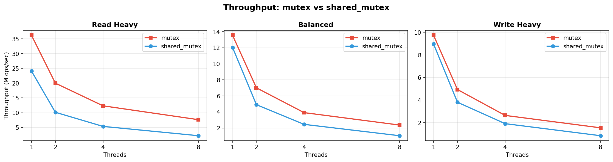
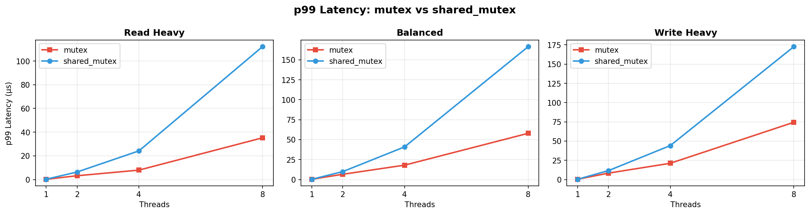
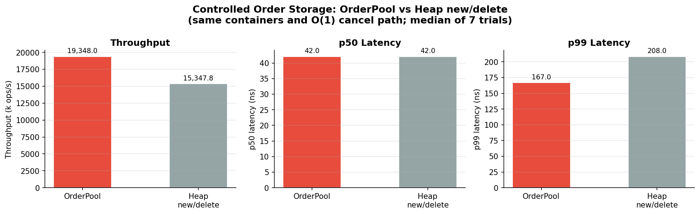
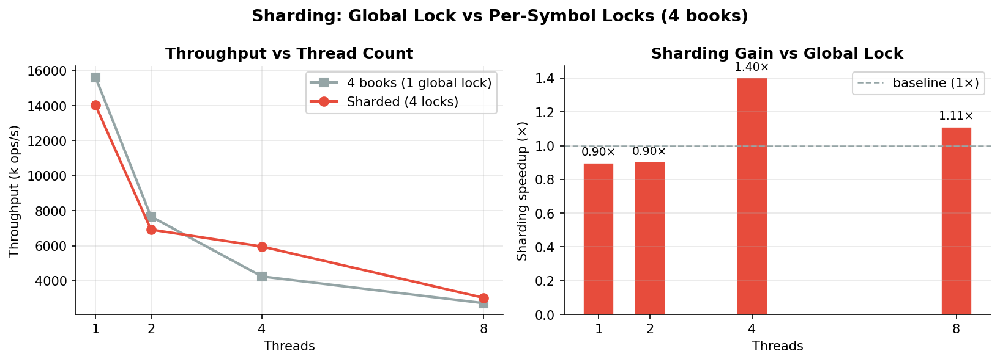

# Concurrent Order Book

A C++17 limit-order-book project for studying matching correctness, lock-policy
trade-offs, pooled order storage, and per-symbol sharding.

The repository originally reported strong performance results, but a September
2026 audit found both matching bugs and benchmark confounders. The engine and
benchmarks have since been corrected. This README reports the re-audited results,
including the less dramatic results where that is what the controlled experiment
showed.

## Current result at a glance

- Limit orders now stop at their own limit price on every price level.
- SELL FOK depth is scanned from the best bid downward.
- Pool exhaustion no longer inserts a null pointer or reports a resting GTC order
  as accepted when it cannot be stored.
- Release builds keep the test suite's assertions enabled.
- The deterministic concurrent test verifies exactly 40,000 adds and 40,000
  cancels for both lock policies.
- AddressSanitizer and UndefinedBehaviorSanitizer pass the complete test suite.
- The controlled order-storage benchmark shows a **1.26×** median throughput
  improvement for `OrderPool`, not the previously advertised 8.9×.
- At 8 threads and four symbols, per-symbol sharding is **1.11×** faster than four
  books sharing one global mutex, not the previously advertised 2.4×.
- In the 8-thread, 90%-read workload, plain `std::mutex` is **3.45×** faster than
  `std::shared_mutex` on the tested Mac.

See [the audit report](docs/correctness_and_benchmark_revision.md) for exact
before/after reproductions and benchmark limitations.

## Architecture

```text
ShardedOrderBook<LockPolicy>
└── books_: unordered_map<symbol_id, OrderBook>  # one book/lock per symbol

OrderBook<LockPolicy>
├── pool_   : OrderPool
├── bids_   : map<price, list<Order*>>
├── asks_   : map<price, list<Order*>>
└── orders_ : unordered_map<id, list<Order*>::iterator>  # O(1) lookup/erase

OrderPool
├── slots_     : fixed-capacity array of Order storage
└── free_list_ : O(1) stack of free slot indices
```

`OrderPool` removes the separate `new`/`delete` for each `Order` object. It does
**not** eliminate every heap allocation: the price maps, list nodes, hash table,
trade vector, and sharding registry still allocate.

## Matching behaviour

- **Limit GTC** matches at executable prices and rests any remainder.
- **Limit IOC** matches immediately at executable prices and cancels the remainder.
- **Limit FOK** executes only when the entire quantity is available within the
  limit price.
- **Market** consumes available opposite-side liquidity at best price first.
- Resting orders execute at price-time priority: best price, then FIFO.
- A resting GTC order is rejected atomically when the pool is full and matching
  cannot free a slot. An order that consumes a resting order may reuse the freed
  capacity.

Each `OrderBook` represents one symbol. `ShardedOrderBook` provides symbol routing
and isolation across multiple books.

## Correctness audit

The old suite passed, but it did not cover the conditions that exposed three bugs:

| Case | Before the audit | After the audit |
|---|---|---|
| BUY limit 100 against asks 100 and 110 | Filled both levels | Fills only 100 |
| SELL FOK with bids above and below its limit | Could stop at the wrong end of the bid map | Scans best bid to worst executable bid |
| Full pool, new non-marketable GTC | Could insert `nullptr` and still return accepted | Rejects with no book mutation |
| Release test build | `assert` could be compiled out | `-UNDEBUG` keeps checks active |
| Concurrent test | Only checked that the process did not crash | Verifies exact add/cancel counts |

The suite now runs 24 order-book tests for each lock policy, three pool tests, and
four sharding tests. The new regression cases cover both BUY and SELL limit
boundaries, SELL FOK direction, and three pool-capacity paths.

## Benchmark methodology

All current numbers below were produced on 26 September 2026 on macOS 26.5,
ARM64, Apple Clang 21, with a Release (`-O3`) build.

These are local microbenchmarks, not exchange-scale performance claims:

- fixed random seeds generate identical inputs;
- competing implementations perform the same logical workload;
- execution order alternates between variants to reduce order/thermal bias;
- mutex and sharding results are medians of five trials;
- pool results are medians of seven trials;
- raw per-trial CSVs are retained in `results/`;
- inputs are generated before timing; throughput and latency use separate fresh
  books so clock calls and latency-vector writes do not depress throughput.

### `std::mutex` vs `std::shared_mutex`

The read-heavy workload is 90% reads and 10% writes. At 8 threads:

| Workload | mutex throughput | shared_mutex throughput | Ratio in favour of mutex | mutex p99 | shared_mutex p99 |
|---|---:|---:|---:|---:|---:|
| read-heavy | 7.64M ops/s | 2.22M ops/s | 3.45× | 35.2 μs | 112.1 μs |
| balanced | 2.37M ops/s | 1.04M ops/s | 2.28× | 57.9 μs | 166.5 μs |
| write-heavy | 1.55M ops/s | 0.85M ops/s | 1.82× | 74.4 μs | 172.7 μs |





The benchmark shows that `shared_mutex` loses for these very short critical
sections on this platform. Reader-count/cache-line contention and implementation
overhead are plausible explanations, but this repository does not claim that a
profiler has proven the exact internal cause.

### Controlled `OrderPool` comparison

Both variants use the same `map<price, list<Order*>>`, hash index, input data, and
O(1) iterator-based cancel path. The only intended variable is whether `Order`
objects come from the fixed pool or individual heap `new`/`delete` calls.
Pool construction/preallocation is outside the timed region.

| Order storage | Median throughput | Median p50 | Median p99 |
|---|---:|---:|---:|
| `OrderPool` | 19.35M ops/s | 42 ns | 167 ns |
| Heap `new`/`delete` | 15.35M ops/s | 42 ns | 208 ns |
| Pool / heap | **1.26×** | 1.00× | **19.7% lower p99** |



The previous 8.9× result compared more than allocation strategy: its baseline had
an O(n) cancel path while the pool path used O(1) iterator erasure, and the old
baseline accessed a pointer after erasing its object. That number cannot be
attributed to the memory pool and has been retired.

### Controlled per-symbol sharding comparison

Both sides contain four independent books and receive the same four-symbol stream.
The baseline books share one process-wide mutex; the sharded books have one mutex
per symbol. Symbol registration happens outside the timed region.

| Threads | Global mutex | Per-symbol locks | Sharded / global |
|---:|---:|---:|---:|
| 1 | 15.62M ops/s | 14.02M ops/s | 0.90× |
| 2 | 7.67M ops/s | 6.92M ops/s | 0.90× |
| 4 | 4.25M ops/s | 5.96M ops/s | 1.40× |
| 8 | 2.72M ops/s | 3.03M ops/s | **1.11×** |



The old benchmark compared one book receiving all operations with four sharded
books. That changed both lock topology and book/data semantics. The new result is
smaller, but it isolates the effect being claimed.

## Old claims vs re-audited results

| Topic | Previously presented | Re-audited conclusion |
|---|---|---|
| Matching correctness | Existing suite passed | Three uncovered edge cases required fixes |
| Pool speedup | 8.9×, described as allocator-only | 1.26× in a controlled storage-only comparison |
| Sharding gain at 8T | 2.4× headline; 1.94× in the old README table | 1.11× with equal four-book semantics |
| Read-heavy mutex result | 3.6× at 8T from one instrumented run | 3.45× using five-trial medians and a separate throughput run |
| Root-cause confidence | Lock internals and allocator presented as proven | Explanations are hypotheses until profiler evidence exists |

## Build and run

```bash
cmake -S . -B build -DCMAKE_BUILD_TYPE=Release
cmake --build build -j
./build/test_correctness

./build/bench_comparison
./build/bench_pool
./build/bench_sharding

python3 scripts/plot_results.py
python3 scripts/plot_v2_results.py
```

Requires C++17, CMake 3.10+, and pthreads.

The benchmark executables write both summary and raw-trial data:

- `results/benchmark_results.csv` and `results/benchmark_trials.csv`
- `results/pool_results.csv` and `results/pool_trials.csv`
- `results/sharding_results.csv` and `results/sharding_trials.csv`

## Limitations and next steps

- Results are from one ARM64 Mac and should be rerun on the deployment hardware.
- The benchmarks do not model networking, persistence, recovery, market-data
  sequencing, or end-to-end exchange latency.
- The sharding registry still takes a shared lock for lookup.
- The order pool has fixed capacity and is protected by its containing book's lock;
  it is not independently thread-safe.
- A stronger next step is statistical reporting across machines, plus profiler and
  hardware-counter evidence before making causal claims about locks or cache
  behaviour.
