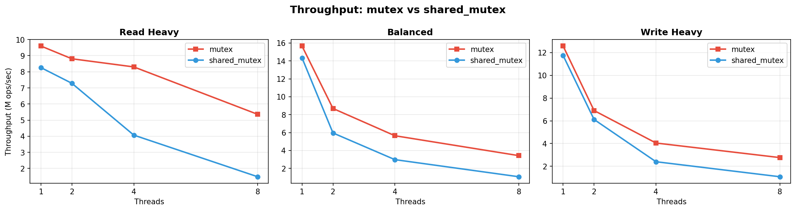
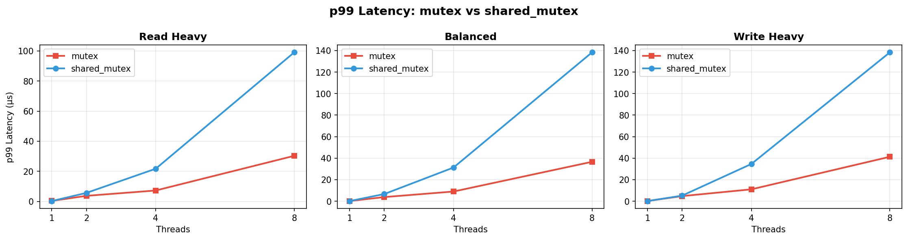

# Concurrent Order Book

A C++17 limit order book that compares mutex vs shared_mutex under contention.

**Question:** When does `std::shared_mutex` actually outperform `std::mutex` in a contended order book?

**Method:** Same order book logic, two lock policies (`std::mutex` exclusive vs `std::shared_mutex` read-write), benchmarked across three workloads and four thread counts. Throughput and p99 latency measured per configuration.

**Short answer:** On this setup (macOS, Apple Silicon), `std::mutex` won in every configuration. `shared_mutex` p99 latency exploded under contention — 99μs vs 30μs at 8 threads on a read-heavy workload. The shared_mutex fairness/reader-count overhead exceeded the benefit of concurrent reads.

---

## Results





### Key numbers (8 threads)

| Workload | mutex throughput | shared_mutex throughput | mutex p99 | shared_mutex p99 |
|----------|-----------------|------------------------|-----------|------------------|
| read_heavy (95/5) | 5.4M ops/sec | 1.5M ops/sec | 30 μs | 99 μs |
| balanced (70/20/10) | 3.4M ops/sec | 1.1M ops/sec | 37 μs | 138 μs |
| write_heavy (20/30/50) | 2.8M ops/sec | 1.1M ops/sec | 41 μs | 138 μs |

### Why shared_mutex lost

The critical sections in this order book are short — `best_bid_price()` is a single `map::rbegin()` dereference. When the protected work is cheap, the lock's internal overhead dominates. `shared_mutex` maintains an atomic reader count and fairness logic that `mutex` doesn't need. Under high contention with many threads, that overhead compounds.

This is platform-dependent. Linux's `pthread_rwlock` implementation may behave differently, especially on NUMA hardware where reader scalability matters more. The result here is specific to macOS/Apple Silicon, which is part of the point: you have to measure.

---

## Architecture

```
OrderBook<LockPolicy>
├── bids_   : std::map<price, std::list<Order>>   // sorted desc for best bid
├── asks_   : std::map<price, std::list<Order>>   // sorted asc for best ask
└── orders_ : std::unordered_map<id, Order*>       // O(1) cancel lookup
```

Lock policy is a compile-time template parameter:

```cpp
OrderBook<MutexPolicy>       // std::mutex — all ops exclusive
OrderBook<SharedMutexPolicy> // std::shared_mutex — reads shared, writes exclusive
```

Same logic, same data structures, only the lock type changes. This ensures a fair comparison.

---

## Order types

- **Limit:** rests on the book at a specified price
- **Market:** matches immediately against resting orders, best price first
- **Cancel:** removes a resting order by ID

Price-time priority: best price first, FIFO within the same price level.

---

## Build

```bash
mkdir build && cd build
cmake -DCMAKE_BUILD_TYPE=Release ..
make
```

Requires C++17, CMake 3.10+, pthreads.

## Run

```bash
./test_correctness    # correctness tests
./bench_comparison    # mutex vs shared_mutex benchmark → results/benchmark_results.csv
python3 scripts/plot_results.py   # generate graphs from CSV
```

---

## Correctness tests

| Test | What it verifies |
|------|-----------------|
| Add limit order | Best bid/ask update correctly |
| Price-time priority | FIFO within same price level |
| Cancel order | Order removed, book state consistent |
| Market order matching | Crosses price levels, partial fills |

Both `OrderBook<MutexPolicy>` and `OrderBook<SharedMutexPolicy>` pass the same test suite.

---

## Benchmark configuration

- **Workloads:** read_heavy (95/5/0), balanced (70/20/10), write_heavy (20/30/50)
- **Thread counts:** 1, 2, 4, 8
- **Ops per thread:** 100,000
- **Seed:** fixed (42) for reproducibility
- **Metrics:** throughput (ops/sec), avg latency (ns), p99 latency (ns)
- **Platform:** macOS, Apple Silicon

---

## What I'd do next

- Run the same benchmark on Linux (x86, NUMA) to see if shared_mutex behaves differently
- Try a spinlock policy for comparison
- Symbol-level sharding with per-book locks
- Longer critical sections (e.g., order validation, logging) where shared_mutex overhead is amortized
